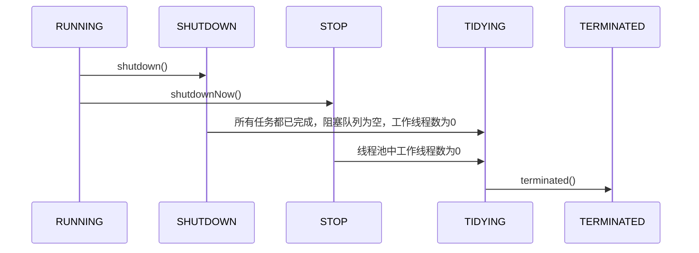

# 一、野生goroutine的问题

> 引言： 毋庸置疑，golang原生的goroutine极大降低了程序员使用并发编程的代价，程序员们不需要再去关心如何实现接口、如何继承Thread类等多余的操作，只需要简简单单的`go`, 就可以开启一个并发的协程。但这种简单的使用方式同时也带来一些问题，这些goroutine不再受我们控制了，它们在运行时可能会发生任何错误或意外，而我们无法得知或去处理这些意外。我们将启动后不再受主进程控制的goroutine称为野生goroutine，本节将介绍野生goroutine存在的一些问题并介绍一些简单的解决方法。

## 1. goroutine中panic无法恢复
正常的函数中panic的recover
```go
import (
    "fmt"
)

func main(){
    defer func(){
        if err := recover(); err != nil{
            fmt.Println(err)
        }
    }()
    var bar = []int{1}
    fmt.Println(bar[1])
}
```

```
reflect: slice index out of range
```

goroutine中panic的恢复
```go
func main(){
	defer func(){
		if err := recover(); err != nil {  // 在这里使用recover(),不能捕获panic
			fmt.Println("catch you, bad guy")
		}
	}()

	go func(){
		fmt.Println("I'm in a goroutine")
		panic("come to catch me")
	}()
	time.Sleep(10 * time.Second) // 主进程做其他事
}
```

```
I'm in a goroutine
panic: come to catch me

goroutine 6 [running]:
main.foo.func2()
        /home/lc/Workspace/lab/main/main.go:22 +0x95
created by main.foo
        /home/lc/Workspace/lab/main/main.go:15 +0x5b

Process finished with the exit code 2
```
上面的程序在`goroutine`中触发了一个`panic`，现在假设`foo()`主进程是我们的服务，我们在服务的`main()`中使用`recover()`尝试捕获程序中发生的panic，但程序运行后发现，goroutine中触发的`panic`没有被捕获，程序直接退出，代表我们的服务挂掉了。显然在正式环境中，我们不可能容忍这样的事情发生，因此需要对`goroutine`中触发的panic进行捕获处理。

显然最简单的方法是在`goroutine`中添加recover(), 进行异常捕获，如下：
```go
func main(){
	go func(){
        defer func(){
            if err := recover(); err != nil {  // 在这里使用recover(),不能捕获panic
                fmt.Println("catch you, bad guy")
            }
	    }()
		fmt.Println("I'm in a goroutine")
		panic("come to catch me")
	}()
	time.Sleep(10 * time.Second) // 主进程做其他事
}
```

```
I'm in a goroutine
catch you, bad guy

Process finished with the exit code 0

```
这时程序正常退出，服务没有挂掉。但每次使用`goroutine`都要加`recover()`稍显麻烦。我们可以使用函数式编程的思想来对`goroutine`进行一下封装：
```go
func Go(f func()){
	go func(){
		defer func(){
			if err := recover(); err != nil{
				fmt.Println("catch you, bad guy")
			}
		}()
		f()
	}()
}

func main(){
	Go(func(){
		fmt.Printf("I'm in a goroutine")
		panic("come to catch me")
	})
	time.Sleep(10 * time.Second) // 主进程做其他事
}
```

```
I'm in a goroutine
catch you, bad guy

Process finished with the exit code 0
```
显然，这样封装过后我们捕获到了panic，但**实际上我们仍然是在`goroutine`内部捕获的panic**，**A goroutine cannot recover from a panic in another goroutine**.    

## 2. goroutine的泄露问题

### 2.1 什么是goroutine泄露
如果你启动了一个goroutine，但并没有符合预期的退出，而是直到程序结束，此goroutine才退出，这种情况就是goroutine泄露。当goroutine泄露发生时，该goroutine所占用的内存不能得到释放，可用内存持续减少，最终将导致系统崩溃。
```go
package main

import "fmt"

func main(){
	for{
		go sayHello()
	}
}

func sayHello(){
	for{
		fmt.Println("hello")
	}
}
```
以上代码是一个最简单的goroutine泄露场景，所有的goroutine都没有退出，而是一直在后台执行。在我的电脑上执行以上代码后，内存占用达到98%。

### 2.2 goroutine泄露发生的原因

#### 2.2.1 channel导致的泄露
**1. 只读不发**
```go
func leak() {
	ch := make(chan int)

	go func() {
		val := <-ch
		fmt.Println("We received a value:", val)
	}()
}
```
在这个函数中，leak创建了一个goroutine，其在从ch中读取一个值之前一直阻塞，但leak并没有往ch中发送值，因此goroutine将一直阻塞，在函数结束前不能得到释放。

**解决方案** 

记得发送
```go
func unleak() {
	ch := make(chan int)

	go func() {
		val := <-ch
		fmt.Println("We received a value:", val)
	}()

	ch <- 1
}
```

**2. 只发不读**
```go
func gen(nums ...int) <-chan int {
	out := make(chan int)
	go func() {
		for _, n := range nums {
			out <- n
		}
		close(out)
	}()
	return out
}

func main() {
	defer func() {
		time.Sleep(time.Second)
		fmt.Println("the number of goroutines: ", runtime.NumGoroutine())
	}()
	
	_ = gen(2, 3)

}
```
```
the number of goroutines:  2
```

在这段代码中，gen向channel中发送数据，但由于没有对channel做接收，因此这个channel将会被阻塞，从而goroutine也不能正常退出，发生了goroutine泄露。

**解决方案** 

利用channel向接收者发送停止消息,goroutine中使用select多路复用接收退出信号。但如果我们想要退出多个goroutine怎么办呢。这时一种可行的方法是使用channel的广播机制向所有goroutine广播消息。  
当一个被关闭的channel中已经发送的数据都被成功接收后，后续的接收操作将不再阻塞，它们会立即返回一个零值。将这个机制拓展一下，不要向channel发送值，而是用关闭一个channel来进行广播。
```go
func gen(done chan struct{}, nums ...int) <-chan int {
	out := make(chan int)
	go func() {
		defer close(out)
		for _, n := range nums {
			select{
			case out <- n:
			case <- done:
				return
			}
		}
	}()
	return out
}

func main() {
	defer func() {
		time.Sleep(time.Second)
		fmt.Println("the number of goroutines: ", runtime.NumGoroutine())
	}()

	done := make(chan struct{})
	defer close(done)
	gen(done, 2, 3)
	gen(done, 2, 3) // 调用两次，代表创建多个goroutine
}
```

```
the number of goroutines:  1
```

**3. select操作在所有case上阻塞**
```go
func fibonacci(c, quit chan int)  {
	x, y := 0, 1
	for{
		select {
		case c <- x:
			x, y = y, x+y
		case <-quit:
			fmt.Println("quit")
			return
		}
	}
}

func main() {
	defer func() {
		time.Sleep(time.Second)
		fmt.Println("the number of goroutines: ", runtime.NumGoroutine())
	}()
	c := make(chan int)
	quit := make(chan int)

	go fibonacci(c, quit)

	for i := 0; i < 10; i++{
		fmt.Println(<- c)
	}

	// close(quit)
}
```

```
the number of goroutines:  2
```
在上面的代码中，我们用一个独立的goroutine作为斐波那契数列的生成器，但是若在主函数的最后忘记向quit发送或关闭quit，那么显然fibonacci将一直运行到main退出，造成goroutine泄露。

**解决方案** 
- 使用defer或在程序的最后往quit中发送或关闭quit
- 使用context包
```go
func fibonacci(c chan int, ctx context.Context)  {
	x, y := 0, 1
	for{
		select {
		case c <- x:
			x, y = y, x+y
		case <-ctx.Done():
			fmt.Println("quit")
			return
		}
	}
}

func main() {
	defer func() {
		time.Sleep(time.Second)
		fmt.Println("the number of goroutines: ", runtime.NumGoroutine())
	}()
	ctx, cancel := context.WithCancel(context.Background())
	defer cancel()

	c := make(chan int)

	go fibonacci(c, ctx)

	for i := 0; i < 10; i++{
		fmt.Println(<- c)
	}
}
```
```
the number of goroutines: 1 
```
`context.WithCancel`接收一个`context.Context`作为参数，返回一个附带Done channel的`concext.Context`的拷贝和一个`cancel`函数，当`cancel`被调用时，附带的Done channel就会被关闭。goroutine中通过检查`ctx.Done()`，就可以得知是否应该退出。

**4. nil channel**
向`nil channel`发送和接收数据都将会导致阻塞。这种情况可能在我们定义 channel 时忘记初始化的时候发生。
```go
func main() {
	defer func() {
		time.Sleep(time.Second)
		fmt.Println("the number of goroutines: ", runtime.NumGoroutine())
	}()

	var ch chan int
	go func() {
		<-ch
		// ch <- 1
	}()
}
```
```
the number of goroutines: 2
```
无论是向nil channel中发送还是接受，都会导致阻塞

**解决方案** 

不要忘记初始化

**5. 死循环**
同[2.1小节](#什么是goroutine泄露)中的情况


#### 2.2.2 同步机制导致的泄露
**1. 锁导致的goroutine泄露**
```go
func main() {
	total := 0

	defer func() {
		time.Sleep(time.Second)
		fmt.Println("the number of goroutines: ", runtime.NumGoroutine())
	}()

	var mutex sync.Mutex
	for i := 0; i < 2; i++ {
		go func() {
			mutex.Lock()
			total += 1
		}()
	}
}
```
在这段代码中，创建了两个goroutine，两个goroutine都要对`total`进行独占访问，但由于第一个goroutine没有解锁，导致第二个goroutine一直阻塞。

**解决方案** 

Lock()之后马上`defer Unlock()`

**2. WaitGroup导致的内存泄露**
```go
func handle() {
	var wg sync.WaitGroup

	wg.Add(4)

	go func() {
		wg.Done()
	}()

	go func() {
		wg.Done()
	}()

	go func() {
		wg.Done()
	}()

	wg.Wait()
}

func main() {
	defer func() {
		time.Sleep(time.Second * 2)
		fmt.Println("the number of goroutines: ", runtime.NumGoroutine())
	}()

	go handle()
}
```

```
the number of goroutines:  2
```
在以上代码中，设置并发任务数为4，但其实只有3个任务，所以`wg.Wait`永远不可能满足。handle将一直被阻塞。

**解决方案** 

建议不要一次性设置任务数量，尽量在任务启动时通过`wg.Add(1)`的方式来增加任务数。

-----
> 使用原生goroutine还存在一个问题，就是在大规模使用时会导致频繁的资源创建与回收，导致性能下降。鉴于以上种种问题，我们应该有某种goroutine管理的机制，能够使得goroutine在panic时不会影响到主进程，在发生长时间阻塞或死锁时能够被动退出，在要用到大量并发协程时能够做到资源复用... 
> 由此我们引出了——池。

# 二、池的思想
> 引言：机器学习中的池化，指的是将某一大小矩阵中的数据经过一定的运算后变成一个更小的矩阵，甚至直接变成一个值，这种池化可有效减小数据量并保留数据特征。而在程序设计中的池化，则是另外一种截然不同的思想，是指通过对资源的有效管理、复用，达到节约资源、提升性能的目的。本小节介绍了池化的基本思想、阐述了一些基本概念。

## 1. 线程池基础

### 1.1 野生线程
在我们平常的开发中，经常会有用到多线程的场景，合理利用多线程可有效利用CPU的多核结构，提高程序的执行效率。有这样一种线程：我们利用其完成一些工作，但只是将工作交给这个线程，该线程并不保证完成任务，也不保证正常退出，并且在线程开始运行后我们无法对其进行控制。这种状态可称为：野生线程，意为其已经不受控制，在内存中自由运行。

这种线程可能带来一系列问题：
- 频繁申请/销毁线程，可能带来巨大的额外消耗
- 当内存中存在较多的野生线程，会导致过分调度，降低系统性能
- 不能正常退出的线程会导致内存泄露
- 系统无法合理管理内部的资源分布，会降低系统的稳定性
- ……

鉴于以上野生线程带来的问题，我们需要一种方式将其管理起来，使其从野生的线程变成"家养"的线程。

### 1.2 什么是线程池
> 池化：池化是一种将资源统一进行管理，从而最大化收益并最小化风险的思想。

线程池维护若干个线程，在总体上控制线程的数量，具体上控制线程的创建、销毁等生命周期，系统可通过申请线程池中的线程异步的完成某个任务。线程池通过对线程的管理实现对资源的有效利用，避免系统资源浪费或内存泄露等问题。

### 1.3 使用线程池的好处
- 线程池中的线程可反复利用，减少了线程创建和销毁的开销
- 任务无需等待线程创建即可开始运行，提高了系统响应速度
- 通过设置合理的线程池线程数，可有效避免资源使用不当，资源浪费
- 对线程运行进行有效的监视与管理

通俗易懂的讲，如果将线程比作完成任务的人，那么线程池就像一个专门管理这些人的部门。当我有任务到来时，直接把任务交给该部门，而不用自己再去找人来完成任务。

## 2. 线程池的工作机制

## 2.1 线程池模型

线程池的内部实际上可以看做是生产者消费者模型，二者并不直接关联，通过任务队列进行交互，从而可以有效的缓冲任务，复用线程。

在线程池模型中，扮演生产者角色的是任务管理部分，其接受提交的任务，并判断任务应如何处理：
1. 直接申请线程执行该任务
2. 缓冲到队列中等待线程执行
3. 直接拒绝该任务

线程管理部分是消费者，线程被统一维护在线程池中，当有任务请求到来时，某一线程被分配去执行这个任务，执行完成后继续或许新的任务来执行，最终当线程获取不到任务时，线程就被回收以节省系统资源。

### 2.2 线程池的状态
线程池一方面维护自身的状态，另一方面管理线程和任务，使二者良好的结合从而执行并行任务。
线程池的状态有5种：
|运行状态|状态描述|
|-----|-----|
|RUNNING|能接受新提交的任务，并且也能处理阻塞队列中的任务|
|SHUTDOWN|关闭状态，不再接受新提交的任务，但可以继续处理阻塞队列中已保存的任务|
|STOP|不能接受新任务，也不处理队列中的任务，会中断正在处理任务的线程|
|TIDYING|所有的任务都已终止，有效线程数为0|
|TERMINATED|在terminated()方法执行后进入该状态|
其生命周期转换如下图所示：


### 2.3 任务执行机制

#### 2.3.1 任务调度
任务调度是线程池的主要入口，用户提交任务后，这部分将决定任务如何执行。
任务调度的流程图如下：

1. 提交任务后，首先检测运行池状态，若不是RUNNING，则直接拒绝，线程池要保证在RUNNING状态下执行任务。
2. 如果线程数小于核心数，说明系统还没有被充分利用，则可添加线程并执行。若线程数大于核心数，此时再一味增加线程数只会带来调度开销，则将任务放入阻塞队列。
3. 若阻塞队列未满，则将任务放入阻塞队列等待执行，否则进行下一步。
4. 若线程数小于最大线程数，可添加工作线程执行，若线程数已大于等于最大线程数，此时直接拒绝任务，不予执行。

#### 2.3.2 任务缓冲
线程池的本质是对任务和线程的管理，要让二者分别独立运行。如果不使用线程池，一个任务即一个线程，对任务与线程的管理都将陷入混乱。要分别对任务和线程进行管理，则需要将二者进行解耦，不让二者直接关联。线程池以消费者-生产者模型，通过一个阻塞队列实现二者的解耦。阻塞队列缓存任务，工作线程从阻塞队列中获取任务。

阻塞队列(BlockingQueue)是一个支持两个附加操作的队列。这两个附加的操作是：
1. 在队列为空时，获取元素的线程会等待队列变为非空。
2. 当队列满时，存储元素的线程会等待队列可用。
阻塞队列常用于生产者和消费者的场景，生产者是往队列里添加元素的线程，消费者是从队列里拿元素的线程。阻塞队列就是生产者存放元素的容器，而消费者也只从容器里拿元素。
其工作模式如下：


#### 2.3.3 任务申请
从上文[任务调度](#231-任务调度)部分可知，任务的执行有两种可能：
1. 任务直接由新创建的线程执行
2. 线程从任务队列中获取任务然后执行，执行完任务的空闲进行再次去队列中申请任务执行
第一种情况仅在线程初始创建时出现，多数情况下是第二种情况

线程要从任务缓存模块中不断获取任务执行，定义getTask方法来帮助线程从阻塞队列中获取任务，实现线程管理模块和任务管理模块的通信。其执行流程如下：


这里进行了多次判断，目的在于控制线程的数量，使其符合线程池的状态。如果线程池现在不应该持有那么多线程，则会返回null值。工作线程Worker会不断接收新任务去执行，而当工作线程Worker接收不到任务的时候，就会开始被回收。

#### 2.3.4 任务拒绝
任务拒绝模块是线程池的保护部分。当线程池的任务缓存队列已满，并且线程数达到设定的最大值，就需要拒绝到来的任务，保护线程池。

### 2.4 Worker线程管理

#### 2.4.1 Worker线程
线程池为了掌握线程的状态并维护线程的生命周期，设计了线程池内的工作线程Worker。   
Worker持有一个线程thread和一个初始化的任务firstTask。thread是在Worker创建时创建的线程，可用来执行任务；firstTask保存传入的第一个任务，这个任务可以有也可以为空。如果此值非空，那么Worker会先执行这个任务，再去获取任务执行；如果此值为空，那么Worker直接去阻塞队列中获取任务执行。


线程池需要管理线程的生命周期，需要在线程长时间不运行的时候进行回收。线程池使用一张Hash表去持有线程的引用，这样可以通过添加引用、移除引用这样的操作来控制线程的生命周期。这个时候重要的就是如何判断线程是否在运行。

​Worker是通过继承AQS，使用AQS来实现独占锁这个功能。没有使用可重入锁ReentrantLock，而是使用AQS，为的就是实现不可重入的特性去反应线程现在的执行状态。

1.lock方法一旦获取了独占锁，表示当前线程正在执行任务中。 2.如果正在执行任务，则不应该中断线程。 3.如果该线程现在不是独占锁的状态，也就是空闲的状态，说明它没有在处理任务，这时可以对该线程进行中断。 4.线程池在执行shutdown方法或tryTerminate方法时会调用interruptIdleWorkers方法来中断空闲的线程，interruptIdleWorkers方法会使用tryLock方法来判断线程池中的线程是否是空闲状态；如果线程是空闲状态则可以安全回收。

在线程回收过程中就使用到了这种特性，回收过程如下图所示：

#### 2.4.2 Worker线程增加
增加线程是通过线程池中的addWorker方法，该方法的功能就是增加一个线程，该方法不考虑线程池是在哪个阶段增加的该线程，这个分配线程的策略是在上个步骤完成的，该步骤仅仅完成增加线程，并使它运行，最后返回是否成功这个结果。addWorker方法有两个参数：firstTask、core。firstTask参数用于指定新增的线程执行的第一个任务，该参数可以为空；core参数为true表示在新增线程时会判断当前活动线程数是否少于corePoolSize，false表示新增线程前需要判断当前活动线程数是否少于maximumPoolSize，其执行流程如下图所示：


#### 2.4.3 Worker线程回收
线程池中线程的销毁依赖JVM自动的回收，线程池做的工作是根据当前线程池的状态维护一定数量的线程引用，防止这部分线程被JVM回收，当线程池决定哪些线程需要回收时，只需要将其引用消除即可。Worker被创建出来后，就会不断地进行轮询，然后获取任务去执行，核心线程可以无限等待获取任务，非核心线程要限时获取任务。当Worker无法获取到任务，也就是获取的任务为空时，循环会结束，Worker会主动消除自身在线程池内的引用。

事实上，将线程引用移出线程池就已经结束了线程销毁的部分。但由于引起线程销毁的可能性有很多，线程池还要判断是什么引发了这次销毁，是否要改变线程池的现阶段状态，是否要根据新状态，重新分配线程。

#### 2.4.4 Worker线程执行任务
在Worker类中的run方法调用了runWorker方法来执行任务，runWorker方法的执行过程如下：

1.while循环不断地通过getTask()方法获取任务。 2.getTask()方法从阻塞队列中取任务。 3.如果线程池正在停止，那么要保证当前线程是中断状态，否则要保证当前线程不是中断状态。 4.执行任务。 5.如果getTask结果为null则跳出循环，执行processWorkerExit()方法，销毁线程。


# 三、现有goroutine池的解决方案
> 引言： 本小节简单分析了GitHub上五个goroutine池实现的基本思想，其中部分代码做了简化。

## 1. wazsmwazsm/mortar（★74）

**简单介绍**  

创建一个容量为 N 的池, 在池容量未满时, 每塞入一个任务（生产任务）, 任务池开启一个 worker (建立协程) 去处理任务（消费任务）。 当任务池容量赛满，每塞入一个任务（生产任务）, 任务会被已有的 N 个 worker 抢占执行（消费任务），达到协程限制的功能。**但worker创建后不会回收，除非将整个pool撤销**。

**结构**

```go
type Task struct {
	Handler func(v ...interface{}) // 函数签名
	Params  []interface{} // 参数
}

// Pool task pool
type Pool struct {
	capacity       uint64 // 池的容量，自行制定
	runningWorkers uint64 // 正在运行的worker
	status         int64 // 池的状态
	chTask         chan *Task // 任务队列，worker从中获取任务
	PanicHandler   func(interface{}) // 自定义的PanicHandler，防止因某个goroutine发生panic而导致服务崩溃。
	sync.Mutex // 全局锁
}
```


**核心代码**
```go
// Put put a task to pool
func (p *Pool) Put(task *Task) error {
	p.Lock()  // 加锁，防止数据竞争
	defer p.Unlock()

	if p.status == STOPED { // 检查池是否还在运行
		return ErrPoolAlreadyClosed
	}

	// run worker
	if p.GetRunningWorkers() < p.GetCap() { // worker数量尚未达到容量限制，新建一个worker
		p.run() // 这里存在一个问题，若池中有空闲的worker，也会创建一个新的worker，这个worker创建后也会空闲，存在资源浪费
	}

	// send task
	if p.status == RUNNING {
		p.chTask <- task // 向任务队列发送任务
	}

	return nil
}

func (p *Pool) run() {
	p.incRunning()  // worker计数+1

	go func() {
		defer func() { // 防止因某个goroutine发生panic而导致服务崩溃
			p.decRunning() // worker计数减1
			if r := recover(); r != nil {
				if p.PanicHandler != nil {
					p.PanicHandler(r) // 自定义了panic后操作
				} else {
					log.Printf("Worker panic: %s\n", r) // panic后默认操作
				}
			}
			p.checkWorker() // 检查是否还有worker在运行，保持最少一个worker
		}()

		for { // worker 保持运行
			select {
			case task, ok := <-p.chTask: // 接收task
				if !ok { // 当任务队列被关闭是goroutine退出
					return
				}
				task.Handler(task.Params...) // 执行任务
			}
		}
	}()
}
```

在`Put`函数中，每当放入一个新任务之前，都会直接创建一个新的worker，这显然不甚合理，因为此时池中可能存在空闲的worker，应设法利用这些空闲的worker而不是创建新的worker。

**尝试优化**

一种优化思路是：在`Pool`对象中增加`chIdle chan struct{}`字段，作为空闲标志。放入任务之前首先检查`chIdle`是否存在空闲标志，若存在，则说明此时存在空闲worker，不需创建新的worker，只需将task放入即可。
而若`chIdle`中不存在空闲标志，则检查worker数量是否达到限制，然后创建新的worker。
优化后的核心代码如下：
```go
type Pool struct {
	capacity       uint64
	runningWorkers uint64
	status         int64
	chTask         chan *Task
	chIdle         chan struct{}
	PanicHandler   func(interface{})
	sync.Mutex
}

func (p *Pool) Put(task *Task) error {
	p.Lock()
	defer p.Unlock()

	if p.status == STOPED {
		return ErrPoolAlreadyClosed
	}

	select {
	case <-p.chIdle:
	default:
		if p.GetRunningWorkers() < p.GetCap() {
			p.run()
		}
	}

	// send task
	if p.status == RUNNING {
		p.chTask <- task
	}

	return nil
}

func (p *Pool) run() {
	p.incRunning()
	p.chIdle <- struct{}{}

	go func() {
		defer func() {
			p.decRunning()
			if r := recover(); r != nil {
				if p.PanicHandler != nil {
					p.PanicHandler(r)
				} else {
					log.Printf("Worker panic: %s\n", r)
				}
			}
			p.checkWorker() // check worker avoid no worker running
		}()

		for {
			select {
			case task, ok := <-p.chTask:
				if !ok {
					return
				}
				task.Handler(task.Params...)
				p.chIdle <- struct{}{}
			}
		}
	}()
}
```

优化前后banchmark测试数据对比如下：
```
优化前：BenchmarkPut-4   	  815876	      1460 ns/op	       0 B/op	       0 allocs/op
优化后：BenchmarkPut-4   	  948046	      1323 ns/op	       0 B/op	       0 allocs/op

优化前: BenchmarkPutTimelife-4   	 1000000	      1287 ns/op	       0 B/op	       0 allocs/op
优化后: BenchmarkPutTimelife-4   	  930015	      1356 ns/op	       0 B/op	       0 allocs/op

优化前: BenchmarkPoolPutSetTimes-4   	       1	1433118500 ns/op	   12104 B/op	      52 allocs/op
优化后: BenchmarkPoolPutSetTimes-4   	       1	1474117300 ns/op	    8504 B/op	      42 allocs/op

优化前: BenchmarkPoolTimeLifeSetTimes-4   	       1	1277515600 ns/op	   10208 B/op	      47 allocs/op
优化后: BenchmarkPoolTimeLifeSetTimes-4   	       1	1279696300 ns/op	    7928 B/op	      39 allocs/op
```

**基本使用**
```go
package main

import (
	"fmt"
	"sync"

	"github.com/wazsmwazsm/mortar"
)

func main() {
	// 创建容量为 10 的任务池
	pool, err := mortar.NewPool(10)
	if err != nil {
		panic(err)
	}

	wg := new(sync.WaitGroup)

	for i := 0; i < 1000; i++ {
		wg.Add(1)
		// 创建任务
		task := &mortar.Task{
			Handler: func(v ...interface{}) {
				wg.Done()
				fmt.Println(v)
			},
		}
		// 添加任务函数的参数
		task.Params = []interface{}{i, i * 2, "hello"}
		// 将任务放入任务池
		pool.Put(task)
	}

	wg.Add(1)
	// 再创建一个任务
	pool.Put(&mortar.Task{
		Handler: func(v ...interface{}) {
			wg.Done()
			fmt.Println(v)
		},
		Params: []interface{}{"hi!"}, // 也可以在创建任务时设置参数
	})

	wg.Wait()

	// 安全关闭任务池（保证已加入池中的任务被消费完）
	pool.Close()
	// 如果任务池已经关闭, Put() 方法会返回 ErrPoolAlreadyClosed 错误
	err = pool.Put(&mortar.Task{
		Handler: func(v ...interface{}) {},
	})
	if err != nil {
		fmt.Println(err) // print: pool already closed
	}
}
```


**总结**
goroutine的复用很好的减小了大批量异步任务中的内存分配与垃圾回收压力，但不能回收的goroutine可能在任务波峰过去后成为内存浪费（不撤销池的情况下），适合用于长期大规模执行并发任务的情况下。

## 2. go-playground/pool（★614）

**简单介绍**
提供了`LimitedPool`,`UnLimitedPool`两种池，分别可以创建(worker数量)有限的worker和无限的worker；提供了`Unit task`和`batch Task`两种任务模式，分别适用于单次偶发任务及多次重复任务。`LimitedPool`,`UnLimitedPool`都实现了`Pool`接口。可长期保持运行。

**系统结构**
```go
type Pool interface {
	Queue(fn WorkFunc) WorkUnit // 传入要执行的任务，立即开始执行
	Reset() // 重新初始化一个池
	Cancel() // 取消所有未在运行的任务
	Close() // 清除所有池数据并取消所有未提交的任务
	Batch() Batch // 创建批量任务
}
```

**核心代码**
```go
// passing work and cancel channels to newWorker() to avoid any potential race condition
// betweeen p.work read & write
func (p *limitedPool) newWorker(work chan *workUnit, cancel chan struct{}) {
	go func(p *limitedPool) {

		var wu *workUnit

		defer func(p *limitedPool) {
			if err := recover(); err != nil {
				// ...
			}
		}(p)

		var value interface{}
		var err error

		for {
			select {
			case wu = <-work:

				// possible for one more nilled out value to make it
				// through when channel closed, don't quite understand the why
				if wu == nil {
					continue
				}

				// support for individual WorkUnit cancellation
				// and batch job cancellation
				if wu.cancelled.Load() == nil {
					value, err = wu.fn(wu)

					wu.writing.Store(struct{}{})

					// need to check again in case the WorkFunc cancelled this unit of work
					// otherwise we'll have a race condition
					if wu.cancelled.Load() == nil && wu.cancelling.Load() == nil {
						wu.value, wu.err = value, err

						// who knows where the Done channel is being listened to on the other end
						// don't want this to block just because caller is waiting on another unit
						// of work to be done first so we use close
						close(wu.done)
					}
				}

			case <-cancel:
				return
			}
		}

	}(p)
}

// Queue queues the work to be run, and starts processing immediately
func (p *limitedPool) Queue(fn WorkFunc) WorkUnit {

	w := &workUnit{
		done: make(chan struct{}),
		fn:   fn,
	}

	go func() {
		p.m.RLock()
		if p.closed {
			w.err = &ErrPoolClosed{s: errClosed}
			if w.cancelled.Load() == nil {
				close(w.done)
			}
			p.m.RUnlock()
			return
		}

		p.work <- w

		p.m.RUnlock()
	}()

	return w
}
```

**基本使用**

> Per Unit Work

```go
package main

import (
	"fmt"
	"time"

	"gopkg.in/go-playground/pool.v3"
)

func main() {

	p := pool.NewLimited(10)
	defer p.Close()

	user := p.Queue(getUser(13))
	other := p.Queue(getOtherInfo(13))

	user.Wait()
	if err := user.Error(); err != nil {
		// handle error
	}

	// do stuff with user
	username := user.Value().(string)
	fmt.Println(username)

	other.Wait()
	if err := other.Error(); err != nil {
		// handle error
	}

	// do stuff with other
	otherInfo := other.Value().(string)
	fmt.Println(otherInfo)
}

func getUser(id int) pool.WorkFunc {

	return func(wu pool.WorkUnit) (interface{}, error) {

		// simulate waiting for something, like TCP connection to be established
		// or connection from pool grabbed
		time.Sleep(time.Second * 1)

		if wu.IsCancelled() {
			// return values not used
			return nil, nil
		}

		// ready for processing...

		return "Joeybloggs", nil
	}
}

func getOtherInfo(id int) pool.WorkFunc {

	return func(wu pool.WorkUnit) (interface{}, error) {

		// simulate waiting for something, like TCP connection to be established
		// or connection from pool grabbed
		time.Sleep(time.Second * 1)

		if wu.IsCancelled() {
			// return values not used
			return nil, nil
		}

		// ready for processing...

		return "Other Info", nil
	}
}

```

> Batch Work

```go
package main

import (
	"fmt"
	"time"

	"gopkg.in/go-playground/pool.v3"
)

func main() {

	p := pool.NewLimited(10)
	defer p.Close()

	batch := p.Batch()

	// for max speed Queue in another goroutine
	// but it is not required, just can't start reading results
	// until all items are Queued.

	go func() {
		for i := 0; i < 10; i++ {
			batch.Queue(sendEmail("email content"))
		}

		// DO NOT FORGET THIS OR GOROUTINES WILL DEADLOCK
		// if calling Cancel() it calles QueueComplete() internally
		batch.QueueComplete()
	}()

	for email := range batch.Results() {

		if err := email.Error(); err != nil {
			// handle error
			// maybe call batch.Cancel()
		}

		// use return value
		fmt.Println(email.Value().(bool))
	}
}

func sendEmail(email string) pool.WorkFunc {
	return func(wu pool.WorkUnit) (interface{}, error) {

		// simulate waiting for something, like TCP connection to be established
		// or connection from pool grabbed
		time.Sleep(time.Second * 1)

		if wu.IsCancelled() {
			// return values not used
			return nil, nil
		}

		// ready for processing...

		return true, nil // everything ok, send nil, error if not
	}
}

```

**总结**
功能齐全，但好像用起来不太舒服。

## 3. ivpusic/grpool（★634）
**简单介绍**
用户可以提交task。 Dispatcher接受task，并将其发送给第一个可用的worker。 当worker完成处理工作时，将返回到workers pool。
worker数量和task队列大小是可配置的。 

整个程序以一个调度器为核心，Pool通过调度器来调度worker，worker可复用，但任务结束时worker不会自动回收，不适合长期运行。只能传递无参任务。

**系统结构**
```go
// Gorouting instance which can accept client jobs
type worker struct {
	workerPool chan *worker // 工人池
	jobChannel chan Job // 这个worker独有的任务队列
	stop       chan struct{} 
}

type dispatcher struct {
	workerPool chan *worker // 与worker是同一个workerPool
	jobQueue   chan Job // 与池共有的任务队列
	stop       chan struct{}
}

// Represents user request, function which should be executed in some worker.
type Job func()

type Pool struct {
	JobQueue   chan Job  // 与dispatcher共有的任务队列
	dispatcher *dispatcher
	wg         sync.WaitGroup
}
```

**核心代码**

```go

func (w *worker) start() {
	go func() { //  创建了一个worker
		var job Job
		for {
			// worker free, add it to pool
			w.workerPool <- w // 把worker放入worker池

			select {
			case job = <-w.jobChannel:
				job()
			case <-w.stop:
				w.stop <- struct{}{}
				return
			}
		}
	}()
}

func (d *dispatcher) dispatch() {
	for {
		select {
		case job := <-d.jobQueue:
			worker := <-d.workerPool
			worker.jobChannel <- job
		case <-d.stop: // 停止所有worker
			for i := 0; i < cap(d.workerPool); i++ {
				worker := <-d.workerPool

				worker.stop <- struct{}{}
				<-worker.stop
			}

			d.stop <- struct{}{}
			return
		}
	}
}
```
其程序运行图大致如下：

程序中存在一个`workerPool`，所有的worker都存在在这个池中，在程序的开始，会创建指定数目的worker，一次性放入池中（此后不再增加或减少）。每个worker有一个独有的`jobChannel`，这个`jobChannel`向worker传递其要执行的任务。  
用户通过直接使用`Pool`的`JobQueue`来提交任务，提交的任务会由`dispatcher`接收，然后分配给某个空闲的worker，即放入其`jobChannel`中。


**基本使用**
```go
package main

import (
  "fmt"
  "runtime"
  "time"

  "github.com/ivpusic/grpool"
)

func main() {
  // number of workers, and size of job queue
  pool := grpool.NewPool(100, 50)

  // release resources used by pool
  defer pool.Release()

  // submit one or more jobs to pool
  for i := 0; i < 10; i++ {
    count := i

    pool.JobQueue <- func() {
      fmt.Printf("I am worker! Number %d\n", count)
    }
  }

  // dummy wait until jobs are finished
  time.Sleep(1 * time.Second)
}
```

**性能测试**

**总结**
设计简单，代码简洁清晰，但无panic恢复，不能动态扩容，任务传递简陋，感觉像是一个未完成版本的任务池


## 4. Jeffail/tunny（★2.4k）


**简单介绍**
有两种模式，第一种模式在池创建时即指定任务，池创建完成后任务不可更改，但可传入不同的参数，有返回值。第二种模式在创建时不给定任务，可在池创建后自行指配任务，但只可执行无参数任务且无返回值。支持超时机制，如果任务超过时间期限还没完成，则会终止并返回错误。

**系统结构**
```go
type Pool struct {
	queuedJobs int64 // 当前挂起的任务数

	ctor    func() Worker  // 初始任务
	workers []*workerWrapper
	reqChan chan workRequest

	workerMut sync.Mutex
}

type workerWrapper struct { // 负责管理worker和goroutine的生命周期
	worker        Worker
	interruptChan chan struct{} // 中止信号通道
	reqChan chan<- workRequest // 用于发送任务请求信号
	closeChan chan struct{} // 退出信号通道
	closedChan chan struct{} // 退出标志通道
}

type workRequest struct { // 任务请求信号
	jobChan chan<- interface{} // 用于接收任务
	retChan <-chan interface{} // 用于返回结果
	interruptFunc func() 
}

```

**核心代码**
```go
func (p *Pool) Process(payload interface{}) interface{} {
	// 省略了部分错误处理代码
	request, open := <-p.reqChan
	request.jobChan <- payload
	payload, open = <-request.retChan // 同步等待任务完成
	return payload
}

func (w *workerWrapper) run() {
	jobChan, retChan := make(chan interface{}), make(chan interface{})
	defer func() {
		w.worker.Terminate()
		close(retChan)
		close(w.closedChan)
	}()

	for {
		// NOTE: Blocking here will prevent the worker from closing down.
		w.worker.BlockUntilReady()
		select {
		case w.reqChan <- workRequest{ // tunny.go:156
			jobChan:       jobChan,
			retChan:       retChan,
			interruptFunc: w.interrupt,
		}:
			select {
			case payload := <-jobChan: // tunny.go: 161
				result := w.worker.Process(payload)
				select {
				case retChan <- result: // tunny.go: 163
				case <-w.interruptChan:
					w.interruptChan = make(chan struct{})
				}
			case _, _ = <-w.interruptChan:
				w.interruptChan = make(chan struct{})
			}
		case <-w.closeChan:
			return
		}
	}
}

```
根据以上代码，其主要执行过程如下：
1. 某个goroutine空闲后，通过其`reqChan`通道发送`workRequest`。`workRequest`中包括一个`jobChan`，用于生产者发送任务；一个`retChan`，用于返回执行结果；一个`interrupt Func`，用于任务执行超时时强行停止worker。需要注意的是，`reqChan`是池和workerWrapper共有的，因此发送的`workRequest`可直接被池接收到。
2. 每当池中有新任务时，池尝试从`reqChan`中获取一个`workRequest`，若获取到，则将任务通过`workRequest`持有的`jobChan`(即某个worker持有的`jobChan`)发送到worker
3. 发送完毕后，同步的从`retChan`中读取结果。
4. 若设置了超时时间，则在时间超时后会强制停止


**基本使用**

```go
package main

import (
	"io/ioutil"
	"net/http"
	"runtime"

	"github.com/Jeffail/tunny"
)

func main() {
	numCPUs := runtime.NumCPU()

	pool := tunny.NewFunc(numCPUs, func(payload interface{}) interface{} {
		var result []byte

		// TODO: Something CPU heavy with payload

		return result
	})
	defer pool.Close()

	http.HandleFunc("/work", func(w http.ResponseWriter, r *http.Request) {
		input, err := ioutil.ReadAll(r.Body)
		if err != nil {
			http.Error(w, "Internal error", http.StatusInternalServerError)
		}
		defer r.Body.Close()

		// Funnel this work into our pool. This call is synchronous and will
		// block until the job is completed.
		result := pool.Process(input)

		w.Write(result.([]byte))
	})

	http.ListenAndServe(":8080", nil)
}
```
> 超时演示：
```go
func main() {
	p := tunny.NewFunc(4, func(payload interface{}) interface{} {
		n := payload.(int)
		result := fib(n)
		time.Sleep(5 * time.Second)
		return result
	})
	defer p.Close()

	var wg sync.WaitGroup
	wg.Add(4)
	for i := 0; i < 4; i++ {
		go func(i int) {
			n := rand.Intn(30)
			result, err := p.ProcessTimed(n, time.Second)
			nowStr := time.Now().Format("2006-01-02 15:04:05")
			if err != nil {
				fmt.Printf("[%s]task(%d) failed:%v\n", nowStr, i, err)
			} else {
				fmt.Printf("[%s]fib(%d) = %d\n", nowStr, n, result)
			}
			wg.Done()
		}(i)
	}

	wg.Wait()
}

func fib(n int) int {
	if n <= 1 {
		return 1
	}

	return fib(n-1) + fib(n-2)
}
```


## 5. panjf2000/ants（★5.8k）


**简单介绍**
启动服务之时先初始化一个 Goroutine Pool 池，这个 Pool 维护了一个类似栈的 LIFO 队列 ，里面存放负责处理任务的 Worker，然后在 client 端提交 task 到 Pool 中之后，在 Pool 内部，接收 task 之后的核心操作是：
1. 检查当前 Worker 队列中是否有可用的 Worker，如果有，取出执行当前的 task；
2. 没有可用的 Worker，判断当前在运行的 Worker 是否已超过该 Pool 的容量：{是 —> 再判断工作池是否为非阻塞模式：[是 ——> 直接返回 nil，否 ——> 阻塞等待直至有 Worker 被放回 Pool]，否 —> 新开一个 Worker（goroutine）处理}；
3. 每个 Worker 执行完任务之后，放回 Pool 的队列中等待。

大致流程如下： 

这个库的亮点之一是其为每一个worker设置了过期时间，若worker空闲了一定时间就会被回收，很好的节约了资源。

**系统结构**

```go
type Pool struct {
  capacity int32 // 池的容量
  running int32 // 正在运行的worker
  workers workerArray // 存储可获取的worker
  state int32 // 池的状态
  lock sync.Locker 
  cond *sync.Cond // 条件变量，用于在条件满足时唤醒阻塞的程序
  workerCache sync.Pool
  blockingNum int // 被阻塞的数量
  options *Options
}

type workerArray interface {
	len() int 
	isEmpty() bool
	insert(worker *goWorker) error
	detach() *goWorker
	retrieveExpiry(duration time.Duration) []*goWorker
	reset()
}

type goWorker struct {
	pool *Pool
	task chan func()
	recycleTime time.Time // recycleTime will be update when putting a worker back into queue
}
```

**核心代码**

```go
func NewPool(size int, options ...Option) (*Pool, error) {

	if expiry := opts.ExpiryDuration; expiry < 0 {
		return nil, ErrInvalidPoolExpiry
	} else if expiry == 0 {
		opts.ExpiryDuration = DefaultCleanIntervalTime
	}

	p := &Pool{
		capacity: int32(size),
		lock:     internal.NewSpinLock(),
		options:  opts,
	}
	p.workerCache.New = func() interface{} {
		return &goWorker{
			pool: p,
			task: make(chan func(), workerChanCap),
		}
	}
	if p.options.PreAlloc {
		if size == -1 {
			return nil, ErrInvalidPreAllocSize
		}
		p.workers = newWorkerArray(loopQueueType, size)
	} else {
		p.workers = newWorkerArray(stackType, 0)
	}

	p.cond = sync.NewCond(p.lock)

	// Start a goroutine to clean up expired workers periodically.
	go p.purgePeriodically() // 用一个独立的goroutine来回收过期的worker

	return p, nil
}

func (w *goWorker) run() {
	w.pool.incRunning()
	go func() {
		defer func() {
			w.pool.decRunning()
			w.pool.workerCache.Put(w)
			if p := recover(); p != nil {
				// ...
			}
			// Call Signal() here in case there are goroutine waiting for available workers.
			w.pool.cond.Signal() // 发出信号唤醒某些阻塞等待worker的线程
		}()

		for f := range w.task {
			if f == nil {
				return
			}
			f()
			if ok := w.pool.revertWorker(w); !ok { // 将worker重新放入池中循环利用
				return
			}
		}
	}()
}

// 返回一个可用的worker
func (p *Pool) retrieveWorker() (w *goWorker) {
	spawnWorker := func() { // 返回一个可用的worker
		w = p.workerCache.Get().(*goWorker)
		w.run()
	}

	p.lock.Lock()

	w = p.workers.detach() // 尝试从worker队列中取worker
	if w != nil { // 从队列中获得了worker，直接返回
		p.lock.Unlock()
	} else if capacity := p.Cap(); capacity == -1 || capacity > p.Running() {
		// 队列为空其worker数量未达到限制，则生成新的worker
		p.lock.Unlock()
		spawnWorker()
	} else {  // 队列为空且数量达到限制，则阻塞等待其他worker空闲
		if p.options.Nonblocking {
			p.lock.Unlock()
			return
		}
	retry:
		if p.options.MaxBlockingTasks != 0 && p.blockingNum >= p.options.MaxBlockingTasks {
			p.lock.Unlock()
			return
		}
		p.blockingNum++
		p.cond.Wait() // 阻塞等待可用的worker
		p.blockingNum--
		var nw int
		if nw = p.Running(); nw == 0 { // awakened by the scavenger
			p.lock.Unlock()
			if !p.IsClosed() {
				spawnWorker()
			}
			return
		}
		if w = p.workers.detach(); w == nil {
			if nw < capacity {
				p.lock.Unlock()
				spawnWorker()
				return
			}
			goto retry
		}

		p.lock.Unlock()
	}
	return
}

// 定时清理过期worker
// purgePeriodically clears expired workers periodically which runs in an individual goroutine, as a scavenger.
func (p *Pool) purgePeriodically() {
	heartbeat := time.NewTicker(p.options.ExpiryDuration)
	defer heartbeat.Stop()

	for range heartbeat.C {
		if p.IsClosed() {
			break
		}

		p.lock.Lock()
		expiredWorkers := p.workers.retrieveExpiry(p.options.ExpiryDuration)
		p.lock.Unlock()

		// Notify obsolete workers to stop.
		// This notification must be outside the p.lock, since w.task
		// may be blocking and may consume a lot of time if many workers
		// are located on non-local CPUs.
		for i := range expiredWorkers {
			expiredWorkers[i].task <- nil
			expiredWorkers[i] = nil
		}

		// There might be a situation that all workers have been cleaned up(no any worker is running)
		// while some invokers still get stuck in "p.cond.Wait()",
		// then it ought to wake all those invokers.
		if p.Running() == 0 {
			p.cond.Broadcast()
		}
	}
}

func (wq *workerStack) retrieveExpiry(duration time.Duration) []*goWorker {
	n := wq.len()
	if n == 0 {
		return nil
	}

	expiryTime := time.Now().Add(-duration)
	index := wq.binarySearch(0, n-1, expiryTime)

	wq.expiry = wq.expiry[:0]
	if index != -1 {
		wq.expiry = append(wq.expiry, wq.items[:index+1]...)
		m := copy(wq.items, wq.items[index+1:])
		for i := m; i < n; i++ {
			wq.items[i] = nil
		}
		wq.items = wq.items[:m]
	}
	return wq.expiry
}
```

**基本使用**
```go
package main

import (
	"fmt"
	"sync"
	"sync/atomic"
	"time"

	"github.com/panjf2000/ants/v2"
)

var sum int32

func myFunc(i interface{}) {
	n := i.(int32)
	atomic.AddInt32(&sum, n)
	fmt.Printf("run with %d\n", n)
}

func demoFunc() {
	time.Sleep(10 * time.Millisecond)
	fmt.Println("Hello World!")
}

func main() {
	defer ants.Release()

	runTimes := 1000

	// Use the common pool.
	var wg sync.WaitGroup
	syncCalculateSum := func() {
		demoFunc()
		wg.Done()
	}
	for i := 0; i < runTimes; i++ {
		wg.Add(1)
		_ = ants.Submit(syncCalculateSum)
	}
	wg.Wait()
	fmt.Printf("running goroutines: %d\n", ants.Running())
	fmt.Printf("finish all tasks.\n")

	// Use the pool with a function,
	// set 10 to the capacity of goroutine pool and 1 second for expired duration.
	p, _ := ants.NewPoolWithFunc(10, func(i interface{}) {
		myFunc(i)
		wg.Done()
	})
	defer p.Release()
	// Submit tasks one by one.
	for i := 0; i < runTimes; i++ {
		wg.Add(1)
		_ = p.Invoke(int32(i))
	}
	wg.Wait()
	fmt.Printf("running goroutines: %d\n", p.Running())
	fmt.Printf("finish all tasks, result is %d\n", sum)
}
```

# References

[Java线程池实现原理及其在美团业务中的实践](https://tech.meituan.com/2020/04/02/java-pooling-pratice-in-meituan.html)
[新手一看就懂的线程池！](https://segmentfault.com/a/1190000038220635)
[线程池学习看这篇就够了,万字总结线程池!!!](https://segmentfault.com/a/1190000039097003)
[Golang中的goroutine泄漏问题](https://blog.haohtml.com/archives/19308)
[跟读者聊 Goroutine 泄露的 N 种方法，真刺激！](https://mp.weixin.qq.com/s/ql01K1nOnEZpdbp--6EDYw)
[如何防止 goroutine 泄露](https://juejin.cn/post/6844903891935461383)
[技术解析系列 | PouchContainer Goroutine Leak 检测实践](https://blog.51cto.com/u_13778063/2152654)
[goroutine泄露：原理、场景、检测和防范](https://segmentfault.com/a/1190000019644257)
[Go语言野生goroutine的处理](https://blog.csdn.net/liumingzhuo/article/details/115402058)
[goroutine 到底该怎么用](https://studygolang.com/articles/32206)
[如何查看golang程序中有哪些goroutine 正在执行](https://blog.csdn.net/lanyang123456/article/details/106984623)
[Go 语言踩坑记——panic 与 recover](https://xiaomi-info.github.io/2020/01/20/go-trample-panic-recover/)
[Handling panics in go routines](https://stackoverflow.com/questions/50409011/handling-panics-in-go-routines)
[INSTRUMENTING A GO APPLICATION FOR PROMETHEUS](https://prometheus.io/docs/guides/go-application/)
[Package pprof](https://golang.org/pkg/net/http/pprof/)
[Handling 1 Million Requests per Minute with Go](http://marcio.io/2015/07/handling-1-million-requests-per-minute-with-golang/)
[Go by Example: Worker Pools](https://gobyexample.com/worker-pools)
[Golang : Creating a concurrent worker pool](https://www.prakharsrivastav.com/posts/golang-concurrent-worker-pool/)
[Work Queue Systems](https://www.oreilly.com/library/view/designing-distributed-systems/9781491983638/ch10.html)
[The Case For A Go Worker Pool](https://brandur.org/go-worker-pool)
[Buffered Channels and Worker Pools](https://golangbot.com/buffered-channels-worker-pools/)


